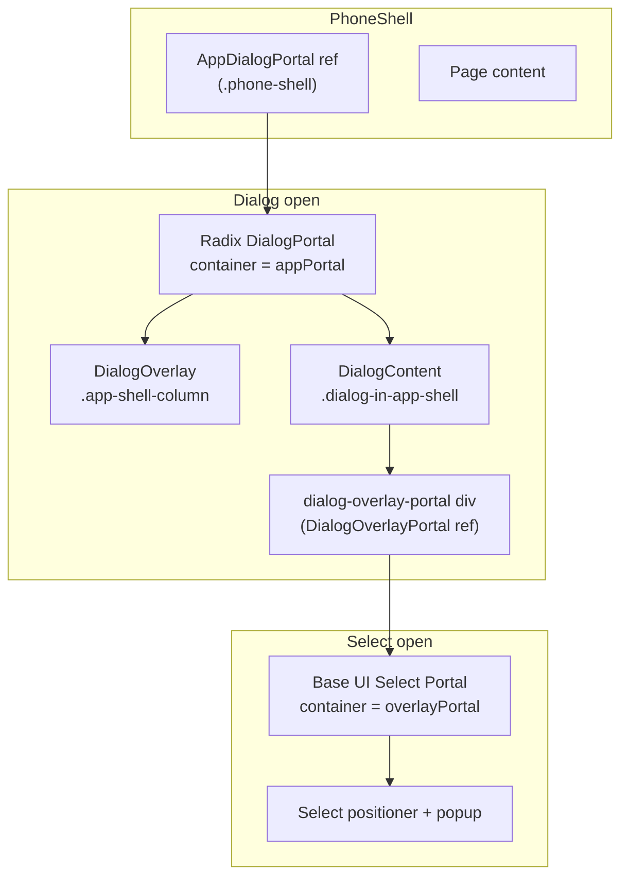

# Dialog / Select / Portal — Deferred Follow-ups

This document records changes identified during the `/simplify` pass on the Settings modal, Select-in-dialog, and app-shell alignment work. Each item was **intentionally skipped** because it needs manual QA, a layout refactor, or feature-scope work beyond a targeted cleanup.

> **Status (2026-07-04):** Items **1, 3, 5, and 7** are done (see per-item notes). Items 2, 4, 6, and 8 remain deferred.

For context on what *was* shipped, see the key files listed at the end.

---

## Current architecture

Dialogs and Select dropdowns inside the app shell use two separate portal targets:



**Alignment:** [`PhoneShell.tsx`](../frontend/components/PhoneShell.tsx) measures `.phone-shell` with `getBoundingClientRect()` and writes document-level CSS variables `--app-shell-left` and `--app-shell-width`. Portaled overlay and dialog content use those vars in [`tokens.css`](../frontend/design-system/tokens.css) (`.app-shell-column`, `.dialog-in-app-shell`) so modals stay centered within the phone shell instead of the full viewport.

**Outside-click guards:** removed (see item 1) — Select popups portal into the in-dialog `dialog-overlay-portal` node, which is a DOM descendant of `DialogContent`, so Radix never treats them as outside interactions.

---

## 1. Remove outside-interaction guards (maybe obsolete) — ✅ DONE

| | |
|---|---|
| **Files** | [`frontend/components/ui/pixelact-ui/dialog.tsx`](../frontend/components/ui/pixelact-ui/dialog.tsx) |
| **Effort** | Small code change; **requires manual QA** |
| **Risk** | Medium — Select may flash-close or dialog may dismiss on option click |

### Why it exists

Radix Dialog treats portaled content as outside the dialog focus trap. Select popups portal into the in-dialog `[data-slot="dialog-overlay-portal"]` node, which is a DOM descendant of `DialogContent` but may still trigger Radix "outside" events depending on event target and portal timing.

### Why it was deferred

If selects truly portal *inside* `DialogContent`, the guards may be redundant. Removing them is a one-line deletion per handler, but regressions are easy to miss without clicking through every Select in every dialog.

### Proposed approach

1. Delete `isPortaledSelectTarget`, `guardPortaledSelectOutside`, and the three guarded handlers; pass user handlers through directly (or omit them).
2. Manually test:
   - **Settings:** Theme and Language selects — open, pick option, confirm dialog stays open.
   - **Add Line Item:** Type select — same.
   - **Category Manager:** Icon picker select — same.
3. Test both light/dark themes and mobile width (375px).

### Success criteria

- Select opens and stays open while choosing an option.
- Dialog does not close when clicking a select item.
- Clicking the backdrop still closes the dialog.

### Outcome (done)

Deleted `isPortaledSelectTarget`, `guardPortaledSelectOutside`, and the three guarded handlers; user handlers now pass through `{...props}`. QA'd in-browser: Settings Theme/Language selects, Add Line Item Type select, and Category Manager icon picker all open, stay open through option selection, and never dismiss the dialog. Backdrop click still closes the dialog.

---

## 2. CSS-only app-shell alignment (layout refactor)

| | |
|---|---|
| **Files** | [`PhoneShell.tsx`](../frontend/components/PhoneShell.tsx), [`tokens.css`](../frontend/design-system/tokens.css), [`globals.css`](../frontend/app/globals.css) |
| **Effort** | Large — alternative layout strategy |
| **Risk** | High — modal centering regressions across viewports |

### Why JS sync exists

The phone shell is centered in the viewport with a max width (`28rem`, `56rem` at `lg`). Portaled Radix overlay/content render into `.phone-shell` but use `position: fixed` with coordinates derived from shell geometry. Pure CSS `left: 50%; transform: translateX(-50%)` centers relative to the **viewport**, not the shell, which caused horizontal misalignment (especially with scrollbar gutter).

`syncAppShellMetrics()` bridges that gap by publishing shell `left` and `width` as CSS variables.

### Why it was deferred

Replacing this requires a different positioning model, for example:

- **Container queries** on a shell-scoped containing block so fixed children resolve against the shell.
- **No document-level portal** — keep overlay/content in-flow (conflicts with Radix portal defaults and scroll behavior).
- **`position: fixed` with `inset` relative to a transformed ancestor** — fragile across browsers.

Each option touches dialog, overlay, and possibly auth pages that reuse `.finance-dialog-field` outside the app shell.

### Proposed approach (if pursued)

1. Spike one CSS-only approach in a branch (container query or anchor positioning).
2. Compare against current metrics at: 375px, 768px, 1024px, with/without scrollbar, light/dark.
3. Run `pnpm responsive-check` and inspect `.responsive-audit/` screenshots.
4. Only remove `syncAppShellMetrics` after pixel-perfect parity.

### Known limitation of current fallback

CSS fallbacks (`var(--app-shell-left, 50%)`, `var(--app-shell-width, 28rem)`) are wrong on wide layouts until the first `ResizeObserver` callback — usually one frame, but visible on slow devices.

---

## 3. Drop `window.resize` listener (keep ResizeObserver only) — ✅ DONE

| | |
|---|---|
| **Files** | [`PhoneShell.tsx`](../frontend/components/PhoneShell.tsx) |
| **Effort** | Small |
| **Risk** | Medium — stale `--app-shell-left` on viewport resize |

### Why both listeners exist

`ResizeObserver` fires when the shell **element size** changes. It does **not** fire when the shell **position** changes without a size change — e.g. viewport resize recenters a `margin: auto` shell while width stays `28rem`. In that case only `left` moves; `--app-shell-left` would go stale without `window.resize`.

### Proposed alternatives

- Listen to `window.visualViewport` `resize` / `scroll` (mobile browser chrome).
- Use `ResizeObserver` on `document.body` or a wrapper that captures layout shifts.
- Replace with CSS-only alignment (see item 2).

### Test plan

1. Open Settings at desktop width; slowly drag window narrower/wider.
2. Confirm overlay and dialog stay aligned with phone shell edges (no horizontal drift).
3. Repeat on mobile emulation with virtual keyboard if applicable.

### Outcome (done)

Replaced `window.resize` with a second `ResizeObserver` target: `document.body`. Body resizes cover both viewport resizes and position-only shell shifts (e.g. the Radix scroll lock removing the scrollbar recenters the shell without changing its width — verified this exact drift happened and is now corrected within a frame). Verified `--app-shell-left` stays in sync at 700px and 1200px viewports and through dialog open/close scroll-lock cycles.

---

## 4. Replace Settings currency combobox with Base UI Combobox

| | |
|---|---|
| **Files** | [`SettingsDialog.tsx`](../frontend/components/SettingsDialog.tsx) |
| **Effort** | Medium — new component + styling |
| **Risk** | Low–medium — UX parity for search/filter |

### Current implementation

Custom combobox built from:

- `Input` with `role="combobox"`
- Inline `role="listbox"` `<ul>` (not portaled)
- Document-level `mousedown` listener to close on outside click
- Local state: `currencyOpen`, `currencyQuery`, `filteredCurrencies`

Theme and Language use Base UI **Select** with the dialog portal pattern; currency is intentionally different because it needs type-to-filter across ~150 ISO codes.

### Why it was deferred

Unifying on Base UI Combobox/Autocomplete is a **feature component**, not a simplify cleanup. It requires:

- Pixelact wrapper (`pixelact-ui/combobox.tsx` or similar)
- Portal target decision (inline vs dialog overlay portal)
- Keyboard navigation, aria, and i18n label parity
- Filter UX matching current pinned currencies behavior

### Proposed approach

1. Evaluate `@base-ui/react` Combobox (or Autocomplete) against current filter UX.
2. Wrap in pixelact styling to match `Input` / `SelectTrigger` height and shadow.
3. Reuse `getCurrencyOptions()` and pinned-currency sorting from [`lib/currencies.ts`](../frontend/lib/currencies.ts).
4. Remove the manual `mousedown` listener once Combobox handles dismiss.

---

## 5. Verify dialog `box-shadow-margin` — ✅ DONE

| | |
|---|---|
| **Files** | [`pixelact-ui/dialog.tsx`](../frontend/components/ui/pixelact-ui/dialog.tsx), [`styles/styles.css`](../frontend/components/ui/pixelact-ui/styles/styles.css) |
| **Effort** | Small — visual check only |
| **Risk** | Low — cosmetic clipping/overlap |

### Background

Pixel shadows use `--pixel-box-shadow`, which draws a 4px simulated border on each side. Components normally add `box-shadow-margin` (4px margin) so shadows do not overlap neighbors.

During dialog alignment work, `box-shadow-margin` was **removed** from default `DialogContent` classes while `shadow-(--pixel-box-shadow)` was kept. Field-level controls still use `box-shadow-margin` via `.finance-dialog-field` margin on the slot wrapper.

### What to check

- Settings, Confirm, Add Line Item, Category Manager dialogs at 375px and desktop.
- Shadow not clipped by `overflow-hidden` on dialog or parent.
- Shadow not overlapping the close button or adjacent cards.

### Fix if needed

Re-add `box-shadow-margin` to `DialogContent` **or** ensure `.dialog-content-frame` padding/margin accounts for shadow width (`var(--box-shadow-width)`).

### Outcome (done)

Checked via `pnpm responsive-check` screenshots (both themes, all viewports). The pixel shadow renders on all four dialog sides with no clipping — no `box-shadow-margin` change needed. The audit did surface a **z-index bug**: in-shell dialogs used `z-0`/`z-10`, so the sticky app header (`z-40`) and the add-item FAB (`z-30`) rendered **on top of** the open dialog on phone viewports. Fixed by raising the in-shell overlay and content to `z-50`, matching the out-of-shell dialogs.

---

## 6. Unify dual dialog stacks (Radix vs Base UI)

| | |
|---|---|
| **Files** | [`pixelact-ui/dialog.tsx`](../frontend/components/ui/pixelact-ui/dialog.tsx) (Radix — **in use**), [`ui/dialog.tsx`](../frontend/components/ui/dialog.tsx) (Base UI — **unused**) |
| **Effort** | Large |
| **Risk** | High — every dialog in the app |

### Situation

The app uses **Radix** dialogs via pixelact-ui. **Base UI** dialog exists in `ui/dialog.tsx` (shadcn scaffold) but has **no imports** in app code. Select uses Base UI (`ui/select.tsx`).

This split is workable but increases maintenance: two portal models, two focus-trap behaviors, two sets of outside-event semantics.

### Why it was deferred

Migrating all dialogs to one primitive is a repo-wide refactor with no user-visible benefit if both stacks work. Only worth doing if Base UI becomes the single shadcn target or Radix is removed from dependencies.

### If pursued

1. Inventory all `pixelact-ui/dialog` usages.
2. Port portal/overlay/shell alignment logic to the chosen primitive.
3. Delete the unused stack and update AGENTS.md component import rules.

---

## 7. Portal container undefined on first render — ✅ DONE

| | |
|---|---|
| **Files** | [`pixelact-ui/dialog.tsx`](../frontend/components/ui/pixelact-ui/dialog.tsx) |
| **Effort** | Small–medium |
| **Risk** | Low — possible one-frame flash or double portal mount |

### Issue

`portalContainer = appPortalRef.current` is read during render. On the first paint after open, the ref may still be `null`, so Radix portals to `document.body` briefly, then re-portals when the ref resolves.

### Proposed approaches

- Gate dialog portal render until `appPortalRef.current` is set (one-frame delay when `inAppShell`).
- Store container in state updated from a layout effect in `PhoneShell` when ref attaches.
- Accept the flash if imperceptible (verify with slow 3G + React strict mode).

### Outcome (done)

Implemented the gating approach: a `usePortalContainer` hook in `pixelact-ui/dialog.tsx` resolves the container in a `useLayoutEffect` (re-checked every render, with setState bail-out once stable) instead of reading `ref.current` during render. When `inAppShell` and the container has not resolved yet, `DialogContent` returns `null` for that frame — the dialog never portals to `document.body` and re-portals. Verified all dialogs mount directly inside `.phone-shell`.

---

## 8. `scrollbar-gutter: stable` (related, keep unless regressions)

| | |
|---|---|
| **Files** | [`globals.css`](../frontend/app/globals.css) |
| **Effort** | N/A — already shipped |
| **Risk** | Removing it may reintroduce shell/dialog horizontal drift |

Added to stabilize layout when scrollbars appear/disappear. Not a simplify target unless it causes unwanted empty gutter on pages that never scroll. If removed, re-test item 2 alignment scenarios.

---

## Priority recommendation

| Priority | Item | Rationale |
|----------|------|-----------|
| ~~1~~ | ~~**5 — box-shadow visual check**~~ | Done — also fixed dialog z-index vs header/FAB |
| ~~2~~ | ~~**1 — remove outside guards**~~ | Done — QA passed in all three dialogs |
| ~~3~~ | ~~**7 — first-render portal**~~ | Done — container resolved via layout effect |
| ~~4~~ | ~~**3 — resize listener**~~ | Done — body ResizeObserver replaces window.resize |
| 1 | **4 — currency Combobox** | UX consistency; independent feature |
| 2 | **2 — CSS-only alignment** | Large refactor; current JS approach works |
| 3 | **6 — unify dialog stacks** | Cleanup when upgrading shadcn/Base UI |

### Related fixes shipped alongside

- `scripts/responsive-check.mjs` now logs in as the seeded dev user (`dev@finance.local`) before capturing — it previously screenshotted the sign-in page for every frame since auth was added. Override with `RESPONSIVE_CHECK_EMAIL` / `RESPONSIVE_CHECK_PASSWORD`.

### Known pre-existing issue (not addressed)

- React hydration warning on the month page: server and client render different attributes on a `Button` inside `CategoryManager` (`components/ui/button.tsx:60`). Visible as a "1 Issue" badge in the Next.js dev overlay. Unrelated to the dialog/portal work.

---

## Key files (shipped baseline)

| File | Role |
|------|------|
| [`frontend/components/DialogPortals.tsx`](../frontend/components/DialogPortals.tsx) | App-level and per-dialog portal ref contexts |
| [`frontend/components/PhoneShell.tsx`](../frontend/components/PhoneShell.tsx) | Shell wrapper, `syncAppShellMetrics`, app dialog portal provider |
| [`frontend/components/ui/pixelact-ui/dialog.tsx`](../frontend/components/ui/pixelact-ui/dialog.tsx) | Radix dialog, shell-aware overlay/content, layout-effect portal container |
| [`frontend/components/ui/select.tsx`](../frontend/components/ui/select.tsx) | Base UI select, `modal={false}`, portals into dialog overlay |
| [`frontend/components/ui/pixelact-ui/select.tsx`](../frontend/components/ui/pixelact-ui/select.tsx) | Pixel-styled select trigger/content |
| [`frontend/components/SettingsDialog.tsx`](../frontend/components/SettingsDialog.tsx) | Settings modal (Select + custom currency combobox) |
| [`frontend/design-system/tokens.css`](../frontend/design-system/tokens.css) | `.dialog-content-frame`, `.app-shell-column`, `.dialog-in-app-shell` |

---

## Verification commands

When implementing any follow-up that touches UI:

```bash
pnpm contrast-check
pnpm responsive-check   # requires dev server on :3000; inspect .responsive-audit/
```

Manual: hard-refresh, open Settings, exercise Theme / Language / Currency, confirm backdrop behind modal, centered in phone shell, no horizontal scroll.
