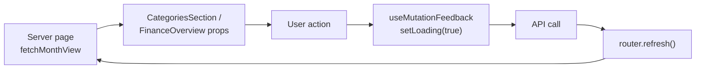
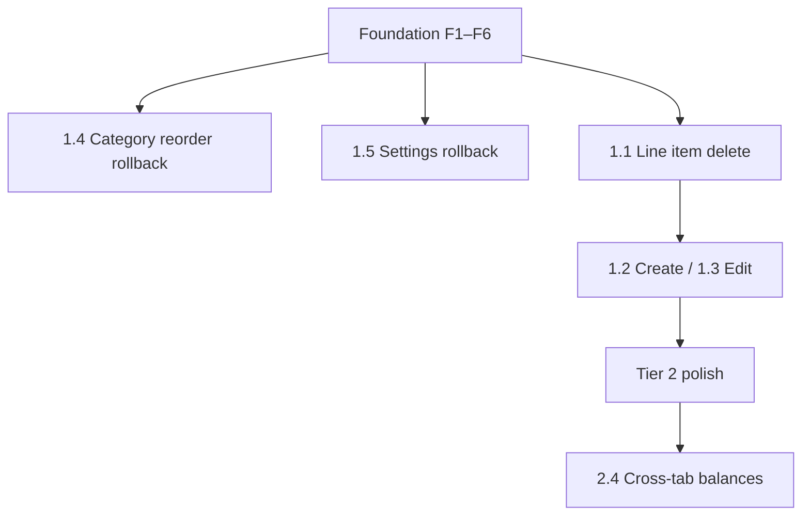

# Optimistic UI — Implementation Plan

This document plans optimistic (instant-feedback) updates across the finance app. It separates work into **three tiers** by UX fit, complexity, and risk. Each tier builds on shared foundation work described in [Foundation](#foundation-shared-across-tiers).

> **Status:** Tier 1 complete (2026-07-05). Tier 2 complete (2026-07-05). Tier 3 pessimistic flows unchanged; scoped loading copy added.

For architecture context, see [AGENTS.md](../AGENTS.md) and the existing pessimistic mutation flow in [`useMutationFeedback.ts`](../frontend/lib/useMutationFeedback.ts).

---

## Goals

1. **Remove perceived latency** on high-frequency actions (line items, category reorder) without waiting for `router.refresh()`.
2. **Keep trust** — rollback on failure with a toast; reconcile with server truth on success.
3. **Stay scoped** — do not optimistically guess auth, multi-month recurrence cascades, or cross-user state.

---

## UX principles (guidelines we follow)

| Principle | Rule |
|-----------|------|
| **Low-stakes only** | If rollback is embarrassing or confusing, stay pessimistic (show loading). |
| **Derivable state** | Optimistic value = current state + user action. No server round-trip needed to compute it. |
| **Rollback first** | Snapshot before mutate; restore + error toast on failure. Never silently revert. |
| **Server is truth** | On success, merge API response or background-refetch; discard the guess. |
| **Pending affordance** | Optimistic rows use subtle pending styling (opacity, badge) until confirmed. |
| **Temp IDs for creates** | Use stable temp keys; swap to real IDs on success without remounting rows. |

**Avoid optimistic UI for:** authentication, logout/navigation side effects, payments, irreversible deletes without confirm, chained mutations with unpredictable outcomes, and multi-month recurrence scope edits.

**References:** [Optimistic UI Patterns](https://rohanshewale.me/blog/2025/11/optimistic-ui-patterns/), [React 19 `useOptimistic`](https://react.dev/reference/react/useOptimistic), TanStack Query `onMutate` / `onError` / `onSettled`.

---

## Current architecture (the bottleneck)



Every client mutation today:

1. Sets global `loading` (disables buttons, shows spinners).
2. Awaits the API.
3. Calls `router.refresh()` to re-run the server component tree.

Month view data lives in RSC pages ([`categories/page.tsx`](../frontend/app/(app)/categories/page.tsx), [`page.tsx`](../frontend/app/(app)/page.tsx)). Client components cannot update the list or balances until the full refresh completes.

### Partial patterns already in the codebase

| Location | What exists | What's missing |
|----------|-------------|----------------|
| [`CategoryManager.tsx`](../frontend/components/CategoryManager.tsx) `handleMove` | `setCategories(reordered)` before API | Rollback on failure; main grid doesn't reorder until refresh |
| [`SettingsDialog.tsx`](../frontend/components/SettingsDialog.tsx) | `updateLocalPreferences` before save | Rollback on API failure for theme/language/currency/name |

---

## Foundation (shared across tiers)

These changes unblock Tier 1 and simplify Tier 2. Implement **before or alongside** Tier 1.

### F1. Client month-view store

Introduce a **`MonthViewProvider`** (React context) seeded from server props:

| Field | Source |
|-------|--------|
| `month` | `lastMonthBalance`, `endingBalance`, `yearMonth` |
| `categories` | Full category + line item tree |
| `uncategorized` | Uncategorized line items |
| `flatCategories` | For dialogs / combobox |

**Consumers:** `CategoriesSection`, `FinanceOverview` (when wired), future reports.

**Initialization:** Server pages pass `fetchMonthView()` result into the provider as `initialData`. Provider owns mutable copy for optimistic patches.

### F2. Shared balance / amount helpers (frontend)

Mirror API logic client-side (already identical in spirit):

```ts
// api/src/models/LineItem.ts — effectiveAmount
displayAmount = realizedAmount ?? plannedAmount

// api/src/services/balanceService.ts — computeBalance
endingBalance = lastMonthBalance + Σ (income ? +amount : -amount)
```

Add `frontend/lib/monthViewMath.ts` with `effectiveAmount`, `computeEndingBalance`, `sumCategoryAmounts` (extract from [`CategorySection.tsx`](../frontend/components/CategorySection.tsx)).

**Scope:** Optimistic balance updates apply to the **currently viewed month only**. Future-month cascade stays server-authoritative.

### F3. Optimistic mutation helper

Extend or wrap [`useMutationFeedback.ts`](../frontend/lib/useMutationFeedback.ts):

```ts
runOptimistic<TSnapshot>({
  apply: () => void,           // patch MonthViewProvider
  snapshot: () => TSnapshot,   // capture rollback state
  rollback: (snap) => void,
  mutate: () => Promise<void>, // API call
  reconcile?: () => void,      // optional: merge response / background refresh
})
```

Alternatively use React 19 **`useOptimistic`** on the month-view reducer inside the provider.

**Per-row loading:** Prefer row-scoped pending state over disabling the entire dialog/list via global `loading`.

### F4. Parse mutation API responses

The API returns line item data on create/update ([`toLineItemMutationResponse`](../api/src/schemas/lineItem.ts)), but frontend helpers discard it:

- [`createLineItem`](../frontend/lib/api.ts) → `Promise<void>`
- [`updateLineItem`](../frontend/lib/api.ts) → `Promise<void>`

**Change:** Return typed `LineItemMutationResponse`; map to full `LineItem` (compute `displayAmount`, `isRealized` client-side) for reconciliation without a full refetch when possible.

### F5. Background reconcile

Keep `router.refresh()` as **settled** reconciliation (fire after success, don't block UI). Optimistic paint is immediate; refresh syncs recurrence metadata and anything the client doesn't model.

### F6. Pending visual language

Add a reusable pending state consistent with the design system:

- Slight opacity on optimistic rows (`opacity-80` or token).
- Optional small pending badge (reuse planned-badge pattern: icon + label).
- Status remains **icon + color + text** — never color alone ([DESIGN_SYSTEM.md](../frontend/DESIGN_SYSTEM.md)).

Run `pnpm contrast-check` and `pnpm responsive-check` after adding pending styles.

---

## Tier 1 — High impact, good UX fit

> **Detailed implementation plan:** [optimistic-ui-tier1-plan.md](./optimistic-ui-tier1-plan.md)

**Theme:** Frequent actions on the categories page; state is derivable; rollback is a toast + list restore.

| ID | Change | Files | Effort | Depends on |
|----|--------|-------|--------|------------|
| **1.1** | Optimistic **line item delete** (non-recurring, after confirm) | [`CategorySection.tsx`](../frontend/components/CategorySection.tsx), provider | Medium | F1–F3, F6 |
| **1.2** | Optimistic **line item create** (single month, no recurrence) | [`LineItemDialog.tsx`](../frontend/components/LineItemDialog.tsx), provider | Medium–High | F1–F4, F6 |
| **1.3** | Optimistic **line item edit** (label, amounts; `scope: "this"` only for recurring) | [`LineItemDialog.tsx`](../frontend/components/LineItemDialog.tsx), provider | Medium | F1–F4, F6 |
| **1.4** | **Category reorder** — add rollback + sync order to main grid | [`CategoryManager.tsx`](../frontend/components/CategoryManager.tsx), provider | Low | F1, F3 |
| **1.5** | **Settings preferences** — rollback on failed save | [`SettingsDialog.tsx`](../frontend/components/SettingsDialog.tsx), [`AuthProvider.tsx`](../frontend/lib/AuthProvider.tsx) | Low | F3 (pattern only) |

### 1.1 Line item delete

**Happy path:** User confirms → row disappears immediately → category total, budget bar, and `endingBalance` update → API → background refresh.

**Rollback:** Restore row at original index; toast error (existing `useMutationFeedback` behavior).

**Defer optimistic:** Recurring items until scope is chosen; for `scope: "this"` only, same as non-recurring. For `future` / `all`, stay pessimistic (Tier 3).

### 1.2 Line item create

**Happy path:** Dialog closes immediately → new row appended with `temp-*` id → totals/balance update → API → replace temp id with server id.

**Edge cases:**

- New category name in combobox: chained create-category + create-line-item — stay pessimistic or optimistic only the line item after category id is known (see Tier 3).
- Recurrence (`repeatMode !== "none"`): stay pessimistic for v1; server creates multiple months.

### 1.3 Line item edit

**Happy path:** Dialog closes → patch row fields in provider → recompute totals/balance → API → reconcile.

**Non-recurring and recurring `scope: "this"`:** optimistic.

**Recurring with scope dialog (`future` / `all`):** pessimistic (Tier 3).

### 1.4 Category reorder

**Already:** `setCategories(reordered)` before API in the manager dialog.

**Add:**

1. Snapshot list before reorder.
2. On API error, restore snapshot + toast.
3. Update provider `categories` order so the main [`CategoriesSection`](../frontend/components/CategoriesSection.tsx) grid reorders without refresh.

### 1.5 Settings rollback

**Already optimistic:** theme, language, currency (and name via `updateLocalName`) apply locally first.

**Add:** On `updateUserProfile` failure, revert to snapshot (theme via existing `applyThemePreference`, locale, currency, name). No `router.refresh()` needed.

### Tier 1 success criteria

- [ ] Delete/create/edit (non-recurring) feels instant on `/categories`.
- [ ] Category totals and budget bar update without full-page stall.
- [ ] Failed mutations restore prior UI and show error toast.
- [ ] No money amounts clipped or truncated at 375px (responsive audit).
- [ ] WCAG contrast unchanged (`pnpm contrast-check` → 0 failures).

---

## Tier 2 — Medium impact, moderate complexity

**Theme:** Polish and cross-surface consistency; builds on Tier 1 provider.

| ID | Change | Files | Effort | Depends on |
|----|--------|-------|--------|------------|
| **2.1** | Optimistic **category rename / icon** save | [`CategoryManager.tsx`](../frontend/components/CategoryManager.tsx), provider | Medium | Tier 1 F1 |
| **2.2** | Optimistic **category add** (temp id in manager + optional empty card on grid) | [`CategoryManager.tsx`](../frontend/components/CategoryManager.tsx), provider | Medium | F1, F4 |
| **2.3** | Optimistic **category delete** (after confirm) | [`CategoryManager.tsx`](../frontend/components/CategoryManager.tsx), provider | Medium | F1, F3 |
| **2.4** | **Shared balance store** — Finance tab balances update when categories tab mutates | [`FinanceOverview.tsx`](../frontend/components/FinanceOverview.tsx), app layout or provider scope | Medium | Tier 1 F1 |
| **2.5** | **Upcoming payments list** stays in sync | [`UpcomingPaymentsList.tsx`](../frontend/components/UpcomingPaymentsList.tsx), provider | Low | Tier 1 |
| **2.6** | Close dialog **before** API on create/edit (optimistic close) | [`LineItemDialog.tsx`](../frontend/components/LineItemDialog.tsx) | Low | 1.2, 1.3 |

### 2.1 Category rename / icon

On Save in manager: patch `categories[].name` / `icon` in provider immediately; rollback on failure. Manager draft state can stay as-is.

### 2.2 Category add

Append to provider with temp id; reconcile with `createCategory` response. Optionally render new [`CategorySection`](../frontend/components/CategorySection.tsx) card (empty state) on the grid.

### 2.3 Category delete

After confirm: remove from provider + grid. **Do not guess** where line items go — on success, reconcile via refresh or API payload if delete endpoint returns reassignment info. Rollback restores category block on failure.

### 2.4 Cross-tab balance sync

Today `/` ([`FinanceOverview`](../frontend/components/FinanceOverview.tsx)) and `/categories` are separate RSC pages. Lift `MonthViewProvider` to [`app/(app)/layout.tsx`](../frontend/app/(app)/layout.tsx) (or a client wrapper) so optimistic `endingBalance` / `lastMonthBalance` on the categories tab reflects on the finance tab without navigation refresh.

**Note:** Layout must receive initial month data — options:

- Fetch month view once in a client layout wrapper (client fetch on mount), or
- Pass month from each page into a layout-adjacent provider (more complex with App Router).

Spike 2.4 before committing to layout shape.

### 2.5 Upcoming payments

Derived from categories + uncategorized. Once provider updates line items, [`UpcomingPaymentsList`](../frontend/components/UpcomingPaymentsList.tsx) recomputes automatically if it reads from context.

### 2.6 Optimistic dialog close

Close dialog immediately on submit; run mutation in background. If mutation fails, reopen dialog with form state restored from snapshot (guideline: don't silently lose user input on rollback).

### Tier 2 success criteria

- [x] Manage categories: add/rename/delete feel instant on grid and in dialog.
- [x] Finance overview balances match categories tab after mutations (same session).
- [x] Upcoming payments add/remove rows without refresh.
- [x] Failed category delete restores category card.

---

## Tier 3 — Explicitly pessimistic (or loading-only)

**Theme:** Do not implement optimistic UI here unless product requirements change. Document expected UX: loading spinners, disabled controls, clear errors.

| ID | Flow | Reason | Current behavior | Recommendation |
|----|------|--------|------------------|----------------|
| **3.1** | Login / signup / forgot / reset password | Auth must be server-confirmed | Pessimistic + redirect | **Keep** |
| **3.2** | Logout | Navigation side effect; rollback confusing | Pessimistic | **Keep** |
| **3.3** | Recurring **convert to series** | Multi-month generation | Pessimistic + spinner in dialog | **Keep**; optional progress copy |
| **3.4** | Recurring edit/delete **`scope: future \| all`** | Unpredictable multi-month delta | Pessimistic after scope dialog | **Keep** |
| **3.5** | Line item create with **recurrence** | Many rows across months | Pessimistic | **Keep** for v1 |
| **3.6** | **Inline new category** during line item create | Chained mutations | Pessimistic until category id returned | **Keep** or split into two visible steps |
| **3.7** | Optimistic **ending balance** when editing **past months** | Cascade rewires future `lastMonthBalance` | N/A today | Only optimistic **viewed month**; never future months |
| **3.8** | Month navigation | Server fetch per month | Link navigation | **Keep**; optional `prefetch` on month links later |

### Tier 3 UX improvements (without optimism)

- [x] Scoped loading indicators on confirm buttons instead of freezing entire lists.
- [x] Disable only the affected row's actions during in-flight pessimistic delete.
- [x] Clear copy for recurrence operations ("Updating series…").

---

## Suggested implementation order



| Phase | Items | Outcome |
|-------|-------|---------|
| **Phase 0** | F1–F6 | Provider, helpers, mutation wrapper, API types |
| **Phase 1** | 1.4, 1.5 | Low-risk wins; validate rollback pattern |
| **Phase 2** | 1.1 → 1.3 | Core categories page instant feedback |
| **Phase 3** | 2.1–2.6 | Manager + cross-tab consistency |
| **Phase 4** | 3.x audit | Confirm pessimistic flows still feel acceptable |

---

## Testing checklist

### Automated

```bash
pnpm contrast-check
pnpm responsive-check   # inspect .responsive-audit/ — amounts not clipped, pending badges readable
pnpm build
```

### Manual (both themes, 375px + desktop)

| Scenario | Expected |
|----------|----------|
| Delete line item (non-recurring) | Row gone immediately; totals update; failure restores row + toast |
| Add line item (no repeat) | Row appears; dialog closes; temp id replaced |
| Edit amounts | Row and totals update; failure restores |
| Reorder category | Grid order updates; failure reverts |
| Change theme in Settings | Instant theme; failure reverts theme |
| Recurring delete (future scope) | Loading until complete; no fake multi-month state |
| Login | No redirect until server success |

### Edge cases

- Two rapid mutations on the same row (queue or cancel in-flight).
- Navigate away mid-mutation (`onSettled` / refresh still runs).
- React Strict Mode double-mount doesn't duplicate optimistic rows.

---

## Key files (reference)

| File | Role |
|------|------|
| [`frontend/lib/useMutationFeedback.ts`](../frontend/lib/useMutationFeedback.ts) | Current pessimistic mutation wrapper |
| [`frontend/lib/api.ts`](../frontend/lib/api.ts) | Client API; extend return types |
| [`frontend/components/CategoriesSection.tsx`](../frontend/components/CategoriesSection.tsx) | Main categories grid |
| [`frontend/components/CategorySection.tsx`](../frontend/components/CategorySection.tsx) | Line item rows, delete |
| [`frontend/components/LineItemDialog.tsx`](../frontend/components/LineItemDialog.tsx) | Create/edit flows |
| [`frontend/components/CategoryManager.tsx`](../frontend/components/CategoryManager.tsx) | Category CRUD + reorder |
| [`frontend/components/SettingsDialog.tsx`](../frontend/components/SettingsDialog.tsx) | Preferences |
| [`frontend/components/FinanceOverview.tsx`](../frontend/components/FinanceOverview.tsx) | Balance display (Tier 2 sync) |
| [`api/src/services/balanceService.ts`](../api/src/services/balanceService.ts) | Server balance source of truth |
| [`api/src/models/LineItem.ts`](../api/src/models/LineItem.ts) | `effectiveAmount` |

---

## Out of scope

- TanStack Query adoption (optional alternative to custom provider; not required for v1).
- Optimistic UI for reports tab ([`ReportsPlaceholder.tsx`](../frontend/components/ReportsPlaceholder.tsx)).
- WebSocket / realtime multi-device sync.
- Changing API cascade semantics — client mirrors **viewed month** only.

---

## Open questions (resolve in Phase 0 spike)

1. **Provider placement:** Client wrapper in `(app)/layout` vs per-page provider with shared module state?
2. **`useOptimistic` vs manual snapshot:** Prefer React 19 native hook inside provider reducer for less boilerplate.
3. **Success toasts:** Keep success toasts on instant actions, or rely on visual confirmation only (less noise)?
