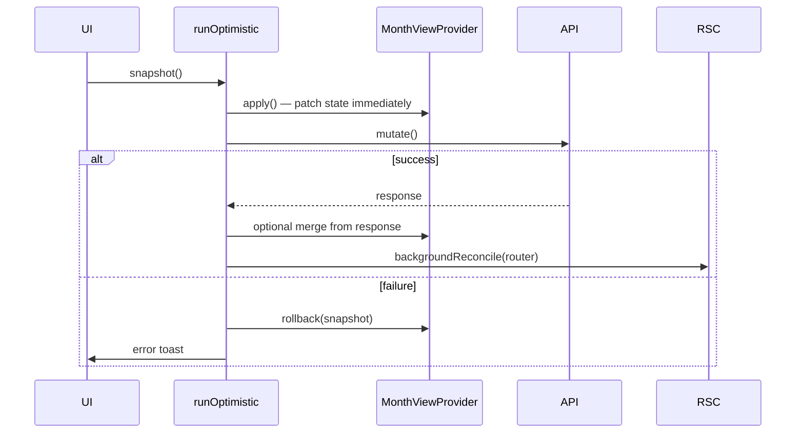

# Optimistic UI — Tier 1 Implementation Plan

Tier 1 migrates high-frequency mutations from the pessimistic `run()` + blocking `router.refresh()` flow to **`runOptimistic`** + **`MonthViewProvider`** patches + **`backgroundReconcile`**.

> **Status:** Complete (2026-07-05). Foundation prerequisite: commit `98654b3`.

**Prerequisite:** Foundation shipped in commit `98654b3` (`MonthViewProvider`, `runOptimistic`, `backgroundReconcile`, `monthViewMath`, `lineItemMappers`, pending UI hooks).

---

## Goals

1. Make line item delete/create/edit and category reorder feel **instant** on `/categories`.
2. Harden **Settings** local-first preferences with rollback on API failure.
3. Keep pessimistic UX for recurrence multi-month flows (Tier 3).

**Out of scope for Tier 1:** cross-tab Finance balance sync (Tier 2.4), category rename/add/delete optimistic (Tier 2), layout-level provider.

---

## Shared mutation pattern

Every Tier 1 month-view mutation follows the same shape:



### Snapshot helper

Add a small helper (or inline in each call site):

```ts
function captureMonthViewSnapshot(view: ReturnType<typeof useMonthView>): MonthViewState {
  return {
    month: view.month,
    categories: view.categories,
    uncategorized: view.uncategorized,
    flatCategories: view.flatCategories,
  };
}
```

Consider exporting `captureMonthViewState()` from [`MonthViewProvider.tsx`](../frontend/lib/MonthViewProvider.tsx) to avoid drift.

### Reconcile

Replace every **`router.refresh()`** inside optimistic flows with:

```ts
import { backgroundReconcile } from "@/lib/backgroundReconcile";

reconcile: () => backgroundReconcile(router),
```

Keep **`router.refresh()`** inside pessimistic branches only.

### Pending rows

| Action | Pending behavior |
|--------|------------------|
| Delete | No pending badge (row removed immediately) |
| Create | `setPending(tempId, true)` until API succeeds; swap to real id; clear pending |
| Edit | `setPending(item.id, true)` until API succeeds |
| Category reorder | Optional: no row-level pending (grid reorder is the feedback) |

[`CategorySection.tsx`](../frontend/components/CategorySection.tsx) already wires `useRowPending`, `.row-pending`, and [`PendingBadge`](../frontend/components/PendingBadge.tsx).

### Pessimistic gate helper

Add to [`frontend/lib/optimisticGates.ts`](../frontend/lib/optimisticGates.ts) (new):

```ts
export function canOptimisticallyDelete(scope?: RecurrenceScope): boolean {
  return !scope || scope === "this";
}

export function canOptimisticallyCreate(repeatMode: RepeatMode, needsNewCategory: boolean): boolean {
  return repeatMode === "none" && !needsNewCategory;
}

export function canOptimisticallyEdit(scope?: RecurrenceScope): boolean {
  return !scope || scope === "this";
}
```

Use these at call sites to fall back to existing `run()` + spinner.

---

## Items

| ID | Change | Primary files | Effort |
|----|--------|---------------|--------|
| **1.4** | Category reorder rollback + grid sync | [`CategoryManager.tsx`](../frontend/components/CategoryManager.tsx) | Low |
| **1.5** | Settings preference rollback | [`SettingsDialog.tsx`](../frontend/components/SettingsDialog.tsx) | Low |
| **1.1** | Optimistic line item delete | [`CategorySection.tsx`](../frontend/components/CategorySection.tsx) | Medium |
| **1.3** | Optimistic line item edit | [`LineItemDialog.tsx`](../frontend/components/LineItemDialog.tsx) | Medium |
| **1.2** | Optimistic line item create | [`LineItemDialog.tsx`](../frontend/components/LineItemDialog.tsx) | Medium–High |

Recommended implementation order: **1.4 → 1.5 → 1.1 → 1.3 → 1.2** (simplest first; create last).

---

## 1.4 — Category reorder

| | |
|---|---|
| **Files** | [`CategoryManager.tsx`](../frontend/components/CategoryManager.tsx) |
| **Effort** | Low |
| **Risk** | Low — reorder already updates local manager state before API |

### Current behavior

`handleMove` calls `setCategories(reordered)` then `run()` + `router.refresh()`. The main categories grid does not reorder until refresh.

### Target behavior

1. Snapshot full `MonthViewState` from `useMonthView()`.
2. Build reordered `Category[]` by reordering provider categories (preserve `lineItems` on each).
3. `apply`: `reorderCategories(reordered)` on provider **and** update local manager `setCategories`.
4. `mutate`: `reorderCategories(items)` API.
5. `reconcile`: `backgroundReconcile(router)`.
6. `rollback`: `setFromServer(snapshot)`.

### Implementation notes

- Import `useMonthView`, `useMonthViewActions` from [`MonthViewProvider.tsx`](../frontend/lib/MonthViewProvider.tsx).
- Map `EditableCategory[]` order to full `Category[]` by matching ids against `useMonthView().categories`.
- Remove `router.refresh()` from the optimistic path; keep `runOptimistic` (not global `loading` disabling all move buttons — optional: track `pendingReorder` locally).
- Sync manager local state from `flatCategories` via existing `useEffect([initialCategories])` — after provider update, `flatCategories` from context updates automatically if manager reads from `useMonthView().flatCategories` instead of prop.

**Refactor:** Change `CategoryManager` to read `flatCategories` from `useMonthView()` and drop `initialCategories` prop from [`CategoriesSection.tsx`](../frontend/components/CategoriesSection.tsx).

### Success criteria

- [ ] Move up/down reorders grid immediately on `/categories`.
- [ ] API failure restores previous order + error toast.
- [ ] Success toast still shown; background refresh syncs server order.

---

## 1.5 — Settings preference rollback

| | |
|---|---|
| **Files** | [`SettingsDialog.tsx`](../frontend/components/SettingsDialog.tsx), [`AuthProvider.tsx`](../frontend/lib/AuthProvider.tsx) |
| **Effort** | Low |
| **Risk** | Low — no month view involved |

### Current behavior

Theme, language, currency, and name apply locally via `updateLocalPreferences` / `updateLocalName` **before** `updateUserProfile`. On API failure, local state stays changed.

### Target behavior

Wrap each save in `runOptimistic` with snapshot of `{ name, themeOption, currency, language }` + auth preferences.

**Rollback:**

| Field | Revert via |
|-------|------------|
| Theme | `updateLocalPreferences({ theme })` + `applyThemePreference` (export from AuthProvider or duplicate import path) |
| Language | `setLanguage`, `setLocale`, `updateLocalPreferences({ language })` |
| Currency | `setCurrency`, `updateLocalPreferences({ currency })` |
| Name | `setName`, `updateLocalName` |

### Implementation notes

- Refactor `savePreferences` to accept snapshot/rollback or split per-field handlers using `runOptimistic`.
- No `backgroundReconcile` needed.
- Keep `run()` for any future settings mutations that shouldn't be optimistic.

### Success criteria

- [ ] Theme/language/currency/name still feel instant.
- [ ] Simulated API failure (wrong network / mock) reverts UI and shows error toast.

---

## 1.1 — Line item delete

| | |
|---|---|
| **Files** | [`CategorySection.tsx`](../frontend/components/CategorySection.tsx) (`LineItemRow`) |
| **Effort** | Medium |
| **Risk** | Medium — must gate recurring scopes |

### Optimistic when

- Non-recurring item (no `seriesId`), after confirm.
- Recurring item with **`scope: "this"`** only (after `RepeatScopeDialog` confirm).

### Pessimistic when

- Recurring delete with **`scope: "future"`** or **`scope: "all"`** — keep existing `run()` + loading + `router.refresh()`.

### Target flow (optimistic path)

```ts
runOptimistic({
  snapshot: () => captureMonthViewSnapshot(view),
  apply: () => {
    actions.removeLineItem(item.id);
    setConfirmingDelete(false);
    setScopeDialogOpen(false);
  },
  mutate: () => deleteLineItem(item.id, scope ? { scope } : undefined),
  reconcile: () => backgroundReconcile(router),
  rollback: (snap) => actions.setFromServer(snap),
  successMessage: t("categories.itemDeleted"),
});
```

### Implementation notes

- Split `performDelete` into optimistic vs pessimistic branches using `canOptimisticallyDelete(selectedScope)`.
- Remove `disabled={loading}` on delete button for optimistic path; keep for pessimistic.
- Category totals, budget bar, and `month.endingBalance` update via provider reducer (already recomputes).

### Success criteria

- [ ] Non-recurring delete: row gone immediately; totals update.
- [ ] Failure: row restored at same position; error toast.
- [ ] Recurring `future`/`all`: spinner on confirm; no optimistic removal.

---

## 1.3 — Line item edit

| | |
|---|---|
| **Files** | [`LineItemDialog.tsx`](../frontend/components/LineItemDialog.tsx) |
| **Effort** | Medium |
| **Risk** | Medium — recurring scope gate |

### Optimistic when

- Non-recurring item.
- Recurring item edited with **`scope: "this"`** (after scope dialog).

### Pessimistic when

- `scope: "future"` or `"all"`.
- **Make recurring** sub-flow (`convertLineItemToRecurrence`) — Tier 3.

### Target flow

1. Build optimistic `LineItem` from form state (preserve `seriesId`, series metadata from `item`).
2. `apply`: close dialog; `replaceLineItem(item.id, optimisticItem)`; `setPending(item.id, true)`.
3. `mutate`: `updateLineItem(...)` → returns `LineItemMutationResponse`.
4. On success: `replaceLineItem(item.id, toLineItemFromMutation(response, seriesMetaFromItem))`; `setPending(item.id, false)`; `backgroundReconcile`.
5. `rollback`: `setFromServer(snapshot)`; reopen dialog optional (Tier 2.6) — for T1, toast only is acceptable per parent plan.

### Provider access

`LineItemDialog` needs `useMonthView` + `useMonthViewActions`. Used from both `/categories` and `/` (FAB) — both are inside `MonthViewShell`. ✓

### Helper: build optimistic line item from form

Add to [`lineItemMappers.ts`](../frontend/lib/lineItemMappers.ts):

```ts
export function buildOptimisticLineItem(
  base: LineItem,
  patch: { label: string; plannedAmount: number; realizedAmount: number | null },
): LineItem
```

Recompute `displayAmount` and `isRealized` via `effectiveAmount`.

### Success criteria

- [ ] Edit label/amounts: dialog closes; row updates immediately; pending badge shown briefly.
- [ ] Failure: prior row state restored; error toast.
- [ ] Recurring `future`/`all`: pessimistic with loading.

---

## 1.2 — Line item create

| | |
|---|---|
| **Files** | [`LineItemDialog.tsx`](../frontend/components/LineItemDialog.tsx), possibly [`lineItemMappers.ts`](../frontend/lib/lineItemMappers.ts) |
| **Effort** | Medium–High |
| **Risk** | Higher — category resolution, temp ids |

### Optimistic when

- `repeatMode === "none"`.
- Category is **existing** (match by name in `flatCategories`) or **uncategorized** label.
- No inline `createCategory` call needed.

### Pessimistic when

- Any recurrence mode (`repeatMode !== "none"`).
- User typed a **new category name** not in `flatCategories` (`needsNewCategory === true`) — chained create-category + create-line-item (Tier 3).

### Target flow

1. Resolve `categoryId` synchronously from combobox value.
2. `tempId = createTempLineItemId()`.
3. Build optimistic `LineItem` from form + temp id.
4. `apply`: close dialog; `addLineItem(categoryId, optimisticItem)`; `setPending(tempId, true)`.
5. `mutate`: `createLineItem(...)` (categoryId already known).
6. On success: `replaceLineItem(tempId, toLineItemFromMutation(response))`; `setPending(tempId, false)`; `backgroundReconcile`.
7. `rollback`: `setFromServer(snapshot)`.

### New category edge case

If combobox value doesn't match existing category and isn't uncategorized label:

```ts
if (!canOptimisticallyCreate(repeatMode, needsNewCategory)) {
  await run(/* existing pessimistic flow with resolveCategoryId */);
  return;
}
```

### FAB on Finance tab

Same `LineItemDialog` — optimistic create updates provider on `/` immediately. **Finance balances on `/` will update** (same provider instance). Upcoming payments list updates too. Navigating to `/categories` fetches a **new** provider instance — Tier 2.4 addresses cross-tab sync.

### Success criteria

- [ ] Add item (existing category, no repeat): row appears instantly; temp id swapped after API.
- [ ] Totals and ending balance update on current page.
- [ ] New category name or recurrence: pessimistic unchanged.
- [ ] Failure: row removed; dialog can stay closed (toast); snapshot restores list.

---

## Provider gaps (address during Tier 1)

| Gap | Fix |
|-----|-----|
| No `captureMonthViewState` export | Add helper on provider module |
| `setPending` after delete | Not needed (row removed) |
| Temp id → real id | `replaceLineItem(tempId, itemWithRealId)` — reducer replaces at temp location with new id ✓ |
| Server sync clobbering optimistic state | Already guarded when `pendingItemIds.size > 0` — ensure `setPending(false)` runs in `finally`-equivalent path (success **and** rollback) |

Add `clearPending(id)` calls on rollback paths to avoid blocking server sync.

---

## Files touched (summary)

| Action | Path |
|--------|------|
| Create | `frontend/lib/optimisticGates.ts` |
| Modify | `frontend/lib/MonthViewProvider.tsx` (optional `captureMonthViewState`) |
| Modify | `frontend/lib/lineItemMappers.ts` (`buildOptimisticLineItem`) |
| Modify | `frontend/components/CategorySection.tsx` (1.1) |
| Modify | `frontend/components/LineItemDialog.tsx` (1.2, 1.3) |
| Modify | `frontend/components/CategoryManager.tsx` (1.4) |
| Modify | `frontend/components/CategoriesSection.tsx` (drop CategoryManager prop if 1.4) |
| Modify | `frontend/components/SettingsDialog.tsx` (1.5) |
| Update | `docs/optimistic-ui-plan.md` status line when Tier 1 complete |

---

## Verification checklist

### Automated

```bash
pnpm build
pnpm contrast-check          # must stay 0 failures
pnpm responsive-check        # required for UI changes — read .responsive-audit/
```

### Manual (light + dark, 375px + desktop)

| # | Scenario | Expected |
|---|----------|----------|
| 1 | Delete non-recurring item | Instant removal; totals update; toast |
| 2 | Delete recurring, scope=this | Same as non-recurring |
| 3 | Delete recurring, scope=future | Loading; no instant removal |
| 4 | Add item, existing category, no repeat | Instant row; pending badge; balance updates |
| 5 | Add item, new category name | Pessimistic (spinner) |
| 6 | Add item with repeat | Pessimistic |
| 7 | Edit amounts | Instant update; pending badge |
| 8 | Edit recurring, scope=all | Pessimistic |
| 9 | Reorder category | Grid reorders instantly |
| 10 | Failed mutation (stop API) | Rollback + error toast |
| 11 | Settings theme change + failure | Theme reverts |
| 12 | Month navigation after mutations | Provider re-seeds from server |

### Responsive audit focus

- Money amounts not clipped with pending badge present.
- Press Start 2P category headers still wrap at 375px.
- Pending badge + planned badge together on same row (edit in-flight on planned item).

---

## Implementation phases

| Phase | Items | Deliverable |
|-------|-------|-------------|
| **T1-A** | 1.4, 1.5 | Rollback pattern proven; reorder + settings hardened |
| **T1-B** | 1.1 | Instant delete on categories page |
| **T1-C** | 1.3 | Instant edit |
| **T1-D** | 1.2 | Instant create (gated) |
| **T1-E** | Verification | responsive-check + doc status update |

---

## Explicitly not Tier 1

| Flow | Tier | Reason |
|------|------|--------|
| Recurring create | 3 | Multi-month generation |
| Recurring delete/edit `future`/`all` | 3 | Unpredictable multi-month delta |
| Inline new category on create | 3 | Chained mutations |
| Convert to recurring | 3 | Multi-month |
| Category rename/add/delete | 2 | Separate manager flows |
| Finance ↔ Categories tab sync | 2.4 | Separate provider instances per page |
| Reopen dialog on edit/create rollback | 2.6 | Nice-to-have form restore |

---

## Key references

| Resource | Path |
|----------|------|
| Parent plan | [optimistic-ui-plan.md](./optimistic-ui-plan.md) |
| Month view store | [MonthViewProvider.tsx](../frontend/lib/MonthViewProvider.tsx) |
| Mutation helper | [useMutationFeedback.ts](../frontend/lib/useMutationFeedback.ts) |
| Background reconcile | [backgroundReconcile.ts](../frontend/lib/backgroundReconcile.ts) |
| Balance math | [monthViewMath.ts](../frontend/lib/monthViewMath.ts) |
| Response mapping | [lineItemMappers.ts](../frontend/lib/lineItemMappers.ts) |
