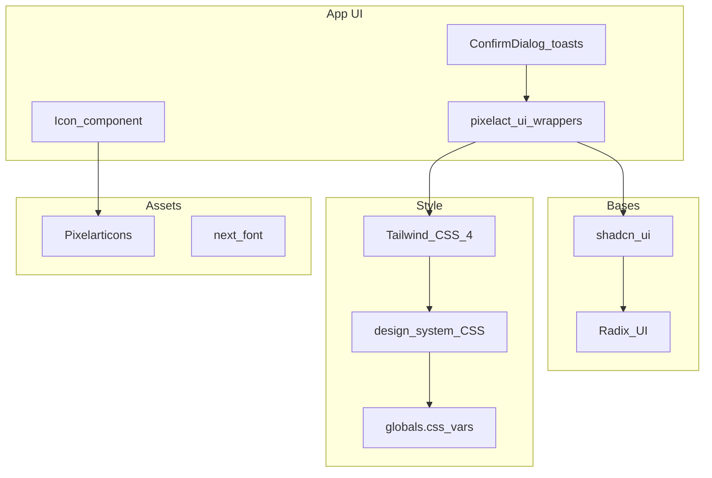
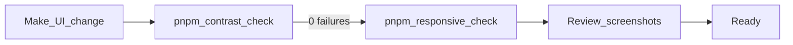

# Cotton Candy Design System

A pixel-widget UI aesthetic for data-dense, mobile-first apps. Soft pink and purple pastels, retro pixel components, and semantic tokens for scannable amounts and status.

See **Tools & stack** below for the full toolchain (component framework, icons, palette, fonts, verification).

## Principles

1. **Clarity** — data should be scannable at a glance
2. **Playfulness** — pixel-art components with retro character
3. **Accessibility** — WCAG AA contrast; never convey status with color alone
4. **Responsive feedback** — bouncy press, hover, loading spinners, pixel alerts
5. **Token-driven** — colors via CSS variables; never hardcode hex, white, or black in components

## Tools & stack

### Component layers

| Layer | Tool | Role |
|-------|------|------|
| Pixel skin | [Pixelact UI](https://www.pixelactui.com/) | Pixel-art wrappers around shadcn bases — buttons, inputs, dialogs, badges. Installed via shadcn registry `@pixelact-ui` (`components.json`). **App code imports `pixelact-ui/*` only.** |
| Component bases | [shadcn/ui](https://ui.shadcn.com/) | Primitives in `components/ui/` — wrapped by Pixelact, not imported directly in app UI |
| Headless primitives | [Radix UI](https://www.radix-ui.com/) | Accessible behavior for Dialog, Select, Collapsible, Label (`@radix-ui/react-*`) |
| Styling | [Tailwind CSS 4](https://tailwindcss.com/) | Utility classes; theme tokens via `@theme inline` in `globals.css`; PostCSS via `@tailwindcss/postcss` |
| Animation utilities | [tw-animate-css](https://github.com/Wombosvideo/tw-animate-css) | Enter/exit animations (`animate-in`, `fade-in-0`, etc.) on dialogs and overlays |



**Adding new Pixelact components:** use the shadcn CLI with the `@pixelact-ui` registry entry in `components.json`. New components land in `components/ui/pixelact-ui/` and can be customized there.

### Icons

| Tool | Role |
|------|------|
| [Pixelarticons](https://pixelarticons.com/) (`pixelarticons` npm) | **Only icon set for app UI.** Per-icon imports from `pixelarticons/react/*`, registered in `lib/icons.ts`, rendered via `<Icon />` |
| lucide-react | Present only inside raw shadcn base components (`components.json` sets `iconLibrary: lucide`). **Not used in app UI.** |

### Palette & theme

| Tool | Role |
|------|------|
| Cotton Candy (custom) | Not a third-party palette — hand-tuned CSS variables in `globals.css` (`:root` / `.dark`) |
| Semantic layer | `design-system/tokens.css` maps pastels → `--finance-*` meaning tokens and utility classes |
| Theming model | shadcn CSS-variables pattern: `.dark` class on `<html>`, toggled by user preference |

### Typography

| Font | Loader | Class / variable |
|------|--------|------------------|
| Press Start 2P | `next/font/google` (self-hosted at build) | `.text-display`, `.text-amount-hero`, `.pixel-font` → `--font-display` |
| Nunito | `next/font/google` | `.text-body` → `--font-sans` |
| JetBrains Mono | `next/font/google` | `.text-amount` → `--font-mono` |

Fonts are loaded in `lib/fonts.ts`. Never add Google Fonts CDN `@import`s in CSS.

### Feedback & overlays

| Tool | Role |
|------|------|
| [Sonner](https://sonner.emilkowal.ski/) | Toast host (`components/ui/sonner.tsx`); custom pixel toast renderer in `pixelact-ui/toast.tsx` |
| `ConfirmDialog` | Destructive action confirmations (wraps pixelact Dialog) |

### Utility libraries

| Tool | Role |
|------|------|
| `class-variance-authority` | Component variant definitions (e.g. button variants) |
| `clsx` + `tailwind-merge` | `cn()` helper in `lib/utils.ts` |
| `@base-ui/react` | Base UI primitives (used by some shadcn v4 components) |

### Verification tools

| Tool | Role |
|------|------|
| `scripts/contrast-check.mjs` | WCAG 2.1 AA audit of theme token pairs (CSS-only, no server) |
| `scripts/responsive-check.mjs` + Playwright | Screenshot audit across themes × viewports → `.responsive-audit/` (generated output — never commit) |

## Architecture

Source-of-truth file map:

```
frontend/app/globals.css                    # shadcn theme vars (:root / .dark), @theme inline
frontend/design-system/
├── tokens.css                              # semantic colors + layout utilities
├── typography.css                          # font role classes
└── interactions.css                        # motion utilities
frontend/components/ui/pixelact-ui/         # pixel wrappers (import these)
frontend/components/ui/pixelact-ui/styles/styles.css  # --pixel-box-shadow
frontend/lib/icons.ts                       # Pixelarticons registry
frontend/lib/fonts.ts                       # next/font setup
scripts/contrast-check.mjs                  # WCAG audit
```

## Cotton Candy palette

Pastel swatches and primary token:

| Token | Hex | Role |
|-------|-----|------|
| `--pastel-pink` | `#fbcfe8` | Secondary fills |
| `--pastel-lavender` | `#e9d5ff` | Planned fills |
| `--pastel-violet` | `#c4b5fd` | Soft violet accent |
| `--primary` | `#c084fc` | Primary actions / balance |
| `--pastel-rose` | `#fda4af` | Expense fills |
| `--pastel-mint` | `#bbf7d0` | Income fills |

**Two-layer color model:**

- **Pastels** (`--pastel-*`, `--finance-income`, etc.) — fills, borders, badges
- **Readable text** (`--finance-*-text`) — darker tints in light mode, pastels in dark mode, so amounts and labels meet WCAG AA

## Themes

Day/night via `.dark` class on `<html>` (shadcn pattern):

| Mode | Background | Character |
|------|------------|-----------|
| Day | Soft pink `#fdf2ff` | Bubblegum lavender |
| Night | Deep purple `#1a1225` | Cozy violet dark |

**User preference:** system / light / dark — configured in **Settings**, persisted to the user profile.

**Flash prevention:** an inline script applies stored preference before first paint (`ThemeFlashScript` + `lib/theme.ts`).

**Intended localStorage contract:** store explicit preference (`system` | `light` | `dark`); resolve `system` at apply-time via `prefers-color-scheme`.

## Semantic colors & status

### Amounts & labels

| Meaning | Text class | Background class |
|---------|------------|------------------|
| Income | `.text-income` | `.bg-income-subtle` / `.bg-income` |
| Expense | `.text-expense` | `.bg-expense-subtle` / `.bg-expense` |
| Planned | `.text-planned` | `.bg-planned-subtle` |
| Balance | `.text-fin-balance` | — |
| Muted copy | `.text-muted-finance` | — |

Income amounts display as green `+$X` (`.text-income`); expenses as rose `-$X` (`.text-expense`). Never allow money to be clipped or truncated.

### Status rule

Status is always **icon + semantic color + text label** — never color alone.

Badges on subtle backgrounds use the matching **semantic text class** (e.g. planned badge → `bg-planned-subtle` + `text-planned` + planned icon), not generic `text-foreground`.

## Typography

| Role | Font | Class |
|------|------|-------|
| Headings | Press Start 2P | `.text-display` |
| Body | Nunito | `.text-body` |
| Amounts | JetBrains Mono | `.text-amount` |
| Hero amounts | Press Start 2P | `.text-amount-hero` |

- Use `.text-amount` for row money values (tabular-nums)
- Use `.text-amount-hero` for hero totals only — not dense rows
- Press Start 2P is very wide; test realistic content (long amounts, labels) at 375px before shipping

## Layout shell

Phone-app column layout — full bleed on mobile, framed on desktop.

| Class | Purpose |
|-------|---------|
| `.phone-shell` | App column: full bleed mobile; framed desktop (max 28rem, 56rem at `lg`) |
| `.app-nav-bar` | Fixed top bar above scrollable main |
| `.app-nav-handle` | Decorative handle bar above the toolbar row |
| `.app-header` | Header row; includes safe-area padding in standalone PWA mode |
| `.app-main` | Scrollable main pane; bottom padding for nav + safe area |
| `.app-bottom-nav` | Fixed bottom tab bar |
| `.app-bottom-nav-item` | Tab item; pair with `.app-bottom-nav-item-active` |
| `.app-bottom-nav-icon` / `.app-bottom-nav-label` | Tab icon and label |
| `.bg-dots` | Page background dot grid |
| `.scroll-viewport` | Internal scroll regions with themed scrollbar |
| `.inventory-slot` | Card/slot chrome with pixel shadow |
| `.icon-slot` | Square icon container with pixel shadow |
| `.pill-title` | Header pill badge (Press Start 2P, primary fill) |

## Pixel shadows

Defined in `components/ui/pixelact-ui/styles/styles.css`:

- `--box-shadow-width: 4px`
- `--pixel-box-shadow` simulates a pixel border via box-shadow
- Always pair interactive elements with `.box-shadow-margin` (or 4px margin) to prevent shadow overlap
- Light mode: shadow color = `var(--foreground)`; dark mode: `var(--ring)` — never hardcoded black

## Interaction patterns

From `design-system/interactions.css`:

| Class | Use |
|-------|-----|
| `.pressable` | Buttons, icon buttons — scale on active |
| `.focus-ring` | Keyboard focus outline (`outline: 2px solid var(--primary)`) |
| `.interactive-surface` | Collapsible triggers, selectable cards — hover background |
| `.interactive-row` | List rows — hover background |
| `.row-actions` | Row action buttons; fade in on row hover (always visible on touch) |
| `.row-pending` | Optimistic/pending row opacity |
| `.add-item-fab` | Mobile FAB positioning; hidden from `sm` up unless `.add-item-fab--persistent` |
| `.btn-add-item` | In-section add button weight |
| `.sparkle-pop` | Success toast sparkle animation |
| `@media (prefers-reduced-motion: reduce)` | Disables transitions and animations |

Motion tokens: `--finance-duration-fast` (100ms), `--finance-duration-normal` (180ms), `--finance-duration-slow` (280ms); easing via `--finance-ease-out`.

## Components

Import from Pixelact UI wrappers:

```tsx
import { Button } from "@/components/ui/pixelact-ui/button";
import { Badge } from "@/components/ui/pixelact-ui/badge";
import { Card, CardContent } from "@/components/ui/pixelact-ui/card";
import { Input } from "@/components/ui/pixelact-ui/input";
import { Label } from "@/components/ui/pixelact-ui/label";
import { Select, SelectContent, SelectItem, SelectTrigger, SelectValue } from "@/components/ui/pixelact-ui/select";
import { Dialog, DialogContent, DialogHeader, DialogTitle, DialogDescription, DialogFooter } from "@/components/ui/pixelact-ui/dialog";
import { Alert, AlertDescription } from "@/components/ui/pixelact-ui/alert";
import { Collapsible, CollapsibleContent, CollapsibleTrigger } from "@/components/ui/pixelact-ui/collapsible";
import { Spinner } from "@/components/ui/pixelact-ui/spinner";
import { useToast } from "@/components/ui/pixelact-ui/toast";
```

**Button variants:** `default`, `secondary`, `success`, `warning`, `destructive`, `link`

**App-level wrappers:**

- `<Icon name="…" />` (`components/Icon.tsx`) — only icon entry point for UI
- `ConfirmDialog` (`components/ConfirmDialog.tsx`) — destructive confirmations; never native `confirm()`

## Icons

Central registry: `lib/icons.ts`

| Export | Purpose |
|--------|---------|
| `IconName` | Union of allowed icon keys |
| `iconMap` | Pixelarticons component per name |
| `iconColorMap` | Default semantic color class per name |
| `iconSizePx` | Sizes: `xs` (12), `sm` (16), `md` (20), `lg` (24) |
| `categoryIcons` | Icons available in category picker |

**Usage:**

```tsx
import { Icon } from "@/components/Icon";

<Icon name="income" size="sm" />
<Icon name="settings" size="md" colorClass="text-muted-finance" />
```

**Adding an icon:**

1. Import from `pixelarticons/react/*`
2. Add to `IconName`, `iconMap`, and `iconColorMap` in `lib/icons.ts`
3. If used in category picker, also add to `categoryIcons` and sync with `api/src/constants/categoryIcons.ts`

Semantic icons (income, expense, planned, balance) get semantic color classes. Neutral and category icons use `text-muted-finance`.

## Forms & dialogs

| Class | Purpose |
|-------|---------|
| `.finance-dialog-form` | Modal form container (`min-width: 0`, no horizontal overflow) |
| `.finance-dialog-field` | Field slot with pixel shadow margin on the slot, not the control |
| `.dialog-content-frame` | Standard modal width (24rem, inset from shell) |

**Dialog portal behavior:** modals inside `.phone-shell` portal to the shell element (not `document.body`) via `DialogPortals`, so overlays stay within the phone frame on desktop.

**Category icon picker** (when used inline): `.category-icon-picker-grid` (4-column grid), `.category-icon-picker-cell`, `.category-icon-picker-cell-selected`, `.category-manager-row-dragging` (opacity while dragging).

## Toasts

- Root layout mounts `<Toaster />` from `components/ui/sonner.tsx`
- Custom pixel renderer in `pixelact-ui/toast.tsx` via `toast()` / `useToast()`
- Variants map to semantic subtle backgrounds:

| Type | Background |
|------|------------|
| success | `.bg-income-subtle` + sparkle animation |
| error | `.bg-expense-subtle` + alert icon |
| info | `.bg-planned-subtle` + info icon |

Mutations should use `useMutationFeedback` (`lib/useMutationFeedback.ts`) for loading state and toast feedback.

## Do / Don't

| Do | Don't |
|----|-------|
| Import from `components/ui/pixelact-ui/` | Import raw `components/ui/*` in app code |
| Icon + semantic color + label for status | Color alone |
| `.text-amount` on money rows | Pixel font on dense rows |
| CSS variables for colors | Hardcoded hex / white / black |
| `ConfirmDialog` for destructive actions | Native `confirm()` |
| Check un-layered `design-system/*.css` when Tailwind "doesn't work" | Assume utility order wins |
| Name custom classes to avoid Tailwind collisions (`.text-fin-balance`) | Use `.text-balance` for a color utility |
| Map new Tailwind color utilities in `@theme inline` | Add unmapped `text-foo` utilities |
| Run verification after UI changes | Ship without contrast / responsive check |
| Render icons via `<Icon />` | Import Pixelarticons or lucide directly in app UI |

## Pitfalls

Learned constraints when mixing design-system CSS with Tailwind:

- **Un-layered CSS beats Tailwind utilities.** Rules in `design-system/*.css` are un-layered and override Tailwind's layered utilities regardless of source order. When a Tailwind class silently fails, check design-system CSS first (e.g. `.app-header` padding vs `py-4`).
- **Don't name custom classes after Tailwind utilities.** Balance color is `.text-fin-balance` because `.text-balance` collides with Tailwind's `text-wrap: balance`.
- **Utility classes must be mapped.** A `text-foo` Tailwind utility only works if `--color-foo` exists in the `@theme inline` block of `globals.css`. Unmapped classes fail silently. Semantic finance classes (`.text-income`, etc.) are defined directly in `tokens.css` and work without `@theme` mapping.
- **Pixel shadows need margin.** `--pixel-box-shadow` draws 4px on each side; use `.box-shadow-margin` or 4px margin to avoid overlap with adjacent elements.
- **Press Start 2P overflows early.** Test pixel-font headings and hero amounts at 375px with realistic content length.

## Verification workflow

Required gate for any UI change:



1. **Make the change.**

2. **`pnpm contrast-check`** — must report 0 failures. Reads `frontend/app/globals.css` and `frontend/design-system/tokens.css`. When adding new text-on-background pairs, add entries to `scripts/contrast-check.mjs`.

3. **`pnpm responsive-check`** — requires dev server on `:3000`. Captures 2 themes × 3 months × 8 viewports into `.responsive-audit/`.

4. **Review screenshots** — both light and dark, all viewports. Check specifically:
   - Nothing clipped or truncated (especially money amounts and badges)
   - Amounts right-aligned
   - Both themes render correctly

`.responsive-audit/` is generated output — never commit it or treat it as source.

## Adding new colors

Checklist when introducing a new color:

1. Add `:root` and `.dark` values in `frontend/app/globals.css`
2. Add Tailwind `@theme inline` mapping in `globals.css` if used as a utility class
3. Add semantic wrapper in `design-system/tokens.css` if it carries app meaning (income, expense, etc.)
4. Add a contrast pair in `scripts/contrast-check.mjs` if text sits on that background
