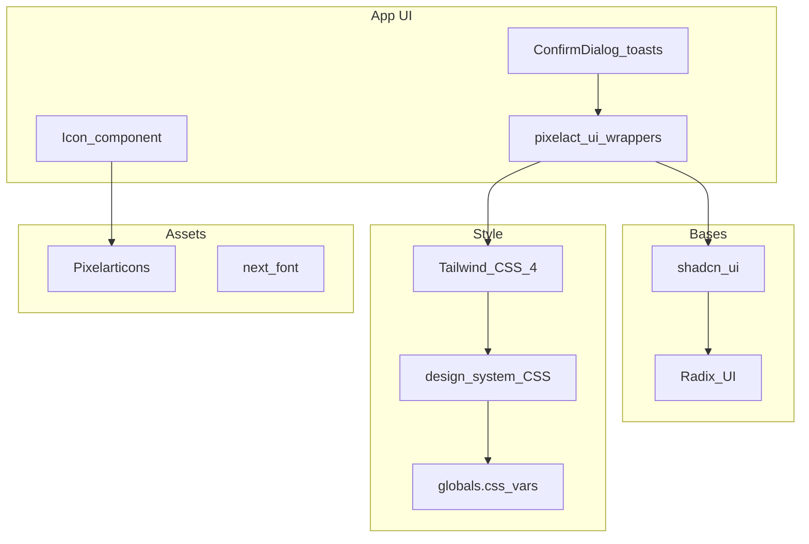
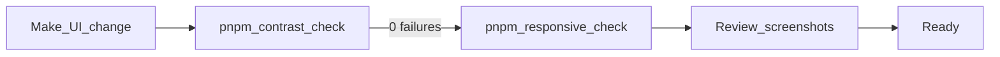

# Cotton Candy Design System

A pixel-widget UI aesthetic for data-dense, mobile-first apps. Soft pink and purple pastels, retro pixel components, and semantic tokens for scannable amounts and status.

See **Tools & stack** below for the full toolchain (component framework, icons, palette, fonts, verification).

## Principles

1. **Clarity** — data should be scannable at a glance
2. **Playfulness** — pixel-art components with retro character
3. **Accessibility** — WCAG AA contrast; never convey status with color alone
4. **Responsive feedback** — bouncy press, hover, loading spinners, pixel alerts
5. **Token-driven** — colors via CSS variables; never hardcode hex, white, or black in components

## Tools & stack

### Component layers

| Layer | Tool | Role |
|-------|------|------|
| Pixel skin | [Pixelact UI](https://www.pixelactui.com/) | Pixel-art wrappers around shadcn bases — buttons, inputs, dialogs, badges. Installed via shadcn registry `@pixelact-ui` (`components.json`). **App code imports `pixelact-ui/*` only.** |
| Component bases | [shadcn/ui](https://ui.shadcn.com/) | Primitives in `components/ui/` — wrapped by Pixelact, not imported directly in app UI |
| Headless primitives | [Radix UI](https://www.radix-ui.com/) | Accessible behavior for Dialog, Select, Collapsible, Label (`@radix-ui/react-*`) |
| Styling | [Tailwind CSS 4](https://tailwindcss.com/) | Utility classes; theme tokens via `@theme inline` in `globals.css`; PostCSS via `@tailwindcss/postcss` |
| Animation utilities | [tw-animate-css](https://github.com/Wombosvideo/tw-animate-css) | Enter/exit animations (`animate-in`, `fade-in-0`, etc.) on dialogs and overlays |



**Adding new Pixelact components:** use the shadcn CLI with the `@pixelact-ui` registry entry in `components.json`. New components land in `components/ui/pixelact-ui/` and can be customized there.

### Icons

| Tool | Role |
|------|------|
| [Pixelarticons](https://pixelarticons.com/) (`pixelarticons` npm) | **Only icon set for app UI.** Per-icon imports from `pixelarticons/react/*`, registered in `lib/icons.ts`, rendered via `<Icon />` |
| lucide-react | Present only inside raw shadcn base components (`components.json` sets `iconLibrary: lucide`). **Not used in app UI.** |

### Palette & theme

| Tool | Role |
|------|------|
| Cotton Candy (custom) | Not a third-party palette — hand-tuned CSS variables in `globals.css` (`:root` / `.dark`) |
| Semantic layer | `design-system/tokens.css` maps pastels → `--finance-*` meaning tokens and utility classes |
| Theming model | shadcn CSS-variables pattern: `.dark` class on `<html>`, toggled by user preference |

### Typography

| Font | Loader | Class / variable |
|------|--------|------------------|
| Press Start 2P | `next/font/google` (self-hosted at build) | `.text-display`, `.text-amount-hero`, `.text-amount-hero-fluid`, `.pixel-font` → `--font-display` |
| Nunito | `next/font/google` | `.text-body` → `--font-sans` |
| JetBrains Mono | `next/font/google` | `.text-amount` → `--font-mono` |

Fonts are loaded in `lib/fonts.ts`. Never add Google Fonts CDN `@import`s in CSS.

### Feedback & overlays

| Tool | Role |
|------|------|
| [Sonner](https://sonner.emilkowal.ski/) | Toast host (`components/ui/sonner.tsx`); custom pixel toast renderer in `pixelact-ui/toast.tsx` |
| `ConfirmDialog` | Destructive action confirmations (wraps pixelact Dialog) |

### Utility libraries

| Tool | Role |
|------|------|
| `class-variance-authority` | Component variant definitions (e.g. button variants) |
| `clsx` + `tailwind-merge` | `cn()` helper in `lib/utils.ts` |
| `@base-ui/react` | Base UI primitives (used by some shadcn v4 components) |

### Verification tools

| Tool | Role |
|------|------|
| `scripts/contrast-check.mjs` | WCAG 2.1 AA audit of theme token pairs (CSS-only, no server) |
| `scripts/responsive-check.mjs` + Playwright | Screenshot audit across themes × viewports → `.responsive-audit/` (generated output — never commit) |

## Architecture

Source-of-truth file map:

```
frontend/app/globals.css                    # shadcn theme vars (:root / .dark), @theme inline
frontend/design-system/
├── tokens.css                              # semantic colors, shell, grids, pixel shadow tokens
├── typography.css                          # font role classes + fluid hero amounts
└── interactions.css                        # motion utilities, FAB positioning
frontend/components/ui/pixelact-ui/         # pixel wrappers (import these)
frontend/components/ui/pixelact-ui/styles/styles.css  # mirrors --pixel-box-shadow for components
frontend/lib/icons.ts                       # Pixelarticons registry
frontend/lib/fonts.ts                       # next/font setup
scripts/contrast-check.mjs                  # WCAG audit
```

## Cotton Candy palette

Pastel swatches and primary token:

| Token | Hex | Role |
|-------|-----|------|
| `--pastel-pink` | `#fbcfe8` | Secondary fills |
| `--pastel-lavender` | `#e9d5ff` | Planned fills |
| `--pastel-violet` | `#c4b5fd` | Soft violet accent |
| `--primary` | `#c084fc` | Primary actions / balance |
| `--pastel-rose` | `#fda4af` | Expense fills |
| `--pastel-mint` | `#bbf7d0` | Income fills |

**Two-layer color model:**

- **Pastels** (`--pastel-*`, `--finance-income`, etc.) — fills, borders, badges
- **Readable text** (`--finance-*-text`) — darker tints in light mode, pastels in dark mode, so amounts and labels meet WCAG AA

## Themes

Day/night via `.dark` class on `<html>` (shadcn pattern):

| Mode | Background | Character |
|------|------------|-----------|
| Day | Soft pink `#fdf2ff` | Bubblegum lavender |
| Night | Deep purple `#1a1225` | Cozy violet dark |

**User preference:** system / light / dark — configured in **Settings**, persisted to the user profile.

**Flash prevention:** an inline script applies stored preference before first paint (`ThemeFlashScript` + `lib/theme.ts`).

**Intended localStorage contract:** store explicit preference (`system` | `light` | `dark`); resolve `system` at apply-time via `prefers-color-scheme`.

## Semantic colors & status

### Amounts & labels

| Meaning | Text class | Background class |
|---------|------------|------------------|
| Income | `.text-income` | `.bg-income-subtle` / `.bg-income` |
| Expense | `.text-expense` | `.bg-expense-subtle` / `.bg-expense` |
| Planned | `.text-planned` | `.bg-planned-subtle` |
| Balance | `.text-fin-balance` | — |
| Muted copy | `.text-muted-finance` | — |

Income amounts display as green `+$X` (`.text-income`); expenses as rose `-$X` (`.text-expense`). Never allow money to be clipped or truncated.

### Status rule

Status is always **icon + semantic color + text label** — never color alone.

Badges on subtle backgrounds use the matching **semantic text class** (e.g. planned badge → `bg-planned-subtle` + `text-planned` + planned icon), not generic `text-foreground`.

## Typography

| Role | Font | Class |
|------|------|-------|
| Headings | Press Start 2P | `.text-display` |
| Body | Nunito | `.text-body` |
| Row amounts | JetBrains Mono | `.text-amount` |
| Hero amounts | Press Start 2P | `.text-amount-hero` |
| Hero amounts (fluid) | Press Start 2P | `.text-amount-hero-fluid` |

- Use `.text-amount` for row money values (tabular-nums, mono). Pair with `whitespace-nowrap` when the column is narrow.
- Use `.text-amount-hero` for fixed-size hero totals in wide containers only.
- Use `.text-amount-hero-fluid` when Press Start 2P amounts sit in **multi-column grids** or other width-constrained slots (balance trio, etc.).
- Press Start 2P is very wide; never use `break-words` on money — scale down or use fluid sizing instead.

### Fluid hero amounts (container-query clamp)

When three or more hero amounts share a row, fixed `text-base` / `text-lg` will wrap mid-number (e.g. `$6,466.69` breaking after `$6,466.6`).

**Pattern** (see `CoinCounter`):

1. Wrap the amount column in `.coin-counter` (`container-type: inline-size`).
2. Apply `.text-amount-hero-fluid` to the amount element.

```css
/* typography.css */
.coin-counter { container-type: inline-size; }

.text-amount-hero-fluid {
  white-space: nowrap;
  font-size: clamp(0.5625rem, calc(100cqw / 9.5), 1.125rem);
}
```

- **Min** `0.5625rem` (9px) — smallest readable pixel size in tight columns.
- **Preferred** `100cqw / 9.5` — scales with the text column width (~9.5 Press Start “cells” for a typical currency string).
- **Max** `1.125rem` (18px) — cap in single-column / wide layouts.
- Parent grid cells must use `minmax(0, 1fr)` (see responsive grids) so `cqw` resolves correctly.

**When to add fluid clamp:** any Press Start amount in a grid column, badge with a long label, or other slot where overflow or wrapping would break scanability. Row amounts in line items stay on `.text-amount` + `whitespace-nowrap`.

## Layout shell

Phone-app column layout — full bleed on mobile, framed pixel column on desktop. The dotted page background (`.bg-dots` on `<body>`) shows **around** the shell on larger viewports; the shell itself is solid `--background`.

| Class | Purpose |
|-------|---------|
| `.phone-shell` | App column — see **Phone shell behavior** below |
| `.responsive-list-columns` | Compact list grid (upcoming payments) |
| `.responsive-card-columns` | Category / card section grid |
| `.app-nav-bar` | Fixed top bar above the scrollable main |
| `.app-nav-handle` | Decorative handle bar above the toolbar row |
| `.app-header` | Header row; includes safe-area padding in standalone PWA mode |
| `.app-main` | Scrollable main pane; bottom padding for nav + safe area |
| `.app-bottom-nav` | Fixed bottom tab bar |
| `.app-bottom-nav-item` | Tab item; pair with `.app-bottom-nav-item-active` |
| `.app-bottom-nav-icon` / `.app-bottom-nav-label` | Tab icon and label |
| `.bg-dots` | Page background dot grid (on `body`, not inside the shell) |
| `.scroll-viewport` | Internal scroll regions with themed scrollbar |
| `.inventory-slot` | Card/slot chrome with pixel shadow |
| `.icon-slot` | Square icon container with pixel shadow |
| `.pill-title` | Header pill badge (Press Start 2P, primary fill) |

### Phone shell behavior (`.phone-shell`)

`PhoneShell` renders a single flex column that holds header, scrollable main, bottom nav, and **dialog portal target** (`ref` on the shell element).

**Mobile (under 768px)**

- Full viewport width and height (`width: 100%`, `height: 100dvh`, `max-height: 100dvh`).
- Edge-to-edge — **no** outer pixel frame, margin, or outline on the shell.
- `overflow: hidden` on the shell; only `.app-main` scrolls vertically.
- `max-width: 75rem` caps width on very wide phones/tablets in portrait but still full-bleed to screen edges.

**Desktop (`md` / ≥ 768px)**

- Shell floats inside the dotted page: `margin: 1.5rem auto`, `width: calc(100% - 3rem)`, `height: calc(100dvh - 3rem)`.
- **Pixel frame** on the shell (same vocabulary as buttons):
  - `box-shadow: var(--pixel-box-shadow)` — 4px simulated border on all sides
  - `outline: 2px solid var(--frame-border)` — outer stroke (`--foreground` light, `--ring` dark)
  - No CSS `border` property — frame is shadow + outline only
- `max-width: 75rem` (1200px) — wide enough for three-column category grids on desktop.

```text
┌─ body (.bg-dots) ─────────────────────────────────────┐
│  ┌─ .phone-shell (768px+) ────────────────────────┐  │
│  │ ■ pixel shadow + 2px outline                     │  │
│  │  [ header ]                                      │  │
│  │  [ scrollable main ]                             │  │
│  │  [ bottom nav ]                                  │  │
│  │  (dialogs portal here)                           │  │
│  └──────────────────────────────────────────────────┘  │
└───────────────────────────────────────────────────────┘
```

**Dialog portaling:** modals render into the shell element (not `document.body`) via `DialogPortals`, so overlays stay inside the framed column on desktop. Overlay/content use `absolute` positioning when portaled in-shell, `fixed` when not.

**FAB alignment:** `.add-item-fab` `right` offset accounts for shell inset and `75rem` max width so the button sits in the content column, not on the dot background.

### Responsive grids

Two shared grid utilities in `tokens.css`. Both use `minmax(0, 1fr)` so column content can shrink (required for fluid amount clamp).

| Class | Gap | Breakpoints | Used for |
|-------|-----|-------------|----------|
| `.responsive-list-columns` | `0.5rem` | 1 col → 2 @ `sm` (640px) → 3 @ `lg` (1024px) | Upcoming payments list |
| `.responsive-card-columns` | `0.75rem` | 1 col → 2 @ `sm` → 3 @ `lg` | Category sections on `/categories` |

Do not hand-roll `lg:grid-cols-2` for these surfaces — use the utilities so breakpoints stay consistent with the 1200px shell.

## Pixel frame & borders

**Canonical tokens** live in `design-system/tokens.css` (also mirrored in `pixelact-ui/styles/styles.css` for component bundling):

| Token | Value | Role |
|-------|-------|------|
| `--box-shadow-width` | `4px` | Thickness of simulated pixel edge |
| `--pixel-box-shadow` | 4-offset box-shadow ring | Inner pixel border on shell, buttons, cards, inputs |
| `--frame-border` | `--foreground` (light) / `--ring` (dark) | 2px outline color |

**Two-layer frame** (shell @ desktop, every `.pixel__button`, `.inventory-slot`, `.pill-title`):

1. `box-shadow: var(--pixel-box-shadow)`
2. `outline: 2px solid var(--frame-border); outline-offset: 0`

**Buttons** add a third decorative layer: `.pixel__button::after` draws a 4px bottom-right chamfer (`color-mix` of variant fill + foreground). Default buttons use `--primary` fill; secondary uses `--color-secondary`.

**Spacing:** always pair interactive framed elements with `.box-shadow-margin` (or 4px margin) so adjacent shadows do not overlap.

**Light vs dark:** shadow ring follows `--foreground` in light mode and `--ring` in dark mode — never hardcoded black.

## Button colors & variants

Pixelact `Button` maps variants to pixel CSS in `button.css`. Import from `@/components/ui/pixelact-ui/button`.

| Variant | Fill | Foreground | Use for |
|---------|------|------------|---------|
| `default` | `--primary` (purple) | `--primary-foreground` | **Accent controls** — add FAB, settings gear, month prev/next, primary dialog actions, empty-state CTAs |
| `secondary` | `--color-secondary` (pink) | `--color-secondary-foreground` | Cancel, low-emphasis dialog actions, icon pickers |
| `destructive` | `--destructive` | `--destructive-foreground` | Logout, delete |
| `success` / `warning` | semantic tokens | matching foreground | Confirmations, alerts |
| `link` | transparent | `--link` | Inline text actions (no pixel frame) |

**Accent rule:** navigation and primary chrome (settings, month nav, mobile FAB) use `variant="default"` so they match the add button and `pill-title` — not `secondary` (which reads as muted/disabled).

**Icons on primary buttons:** pass `colorClass="text-primary-foreground"` on `<Icon />` so glyphs stay crisp on the purple fill.

**Icon-only buttons:** square sizing via `className="size-9 p-0"` with `size="sm"`; CVA already applies `inline-flex items-center justify-center`.

**Implementation note:** non-`asChild` buttons render a native `<button>` so `onClick` is reliable. Use `asChild` for links (month nav, manage categories).

```tsx
<Button variant="default" size="sm" className="pressable focus-ring size-9 p-0" onClick={…}>
  <Icon name="settings" size="md" colorClass="text-primary-foreground" />
</Button>
```

## Interaction patterns

From `design-system/interactions.css`:

| Class | Use |
|-------|-----|
| `.pressable` | Buttons, icon buttons — scale on active |
| `.focus-ring` | Keyboard focus outline (`outline: 2px solid var(--primary)`) |
| `.interactive-surface` | Collapsible triggers, selectable cards — hover background |
| `.interactive-row` | List rows — hover background |
| `.row-actions` | Row action buttons; fade in on row hover (always visible on touch) |
| `.row-pending` | Optimistic/pending row opacity |
| `.add-item-fab` | Mobile FAB; `position: fixed` via `.add-item-fab.pixel__button`; offset from `--app-bottom-nav-height`, `--fab-gap-above-nav`, shell inset @ `md`; hidden from `sm` unless `.add-item-fab--persistent` |
| `.btn-add-item` | In-section add button weight |
| `.sparkle-pop` | Success toast sparkle animation |
| `@media (prefers-reduced-motion: reduce)` | Disables transitions and animations |

Motion tokens: `--finance-duration-fast` (100ms), `--finance-duration-normal` (180ms), `--finance-duration-slow` (280ms); easing via `--finance-ease-out`.

## Components

Import from Pixelact UI wrappers:

```tsx
import { Button } from "@/components/ui/pixelact-ui/button";
import { Badge } from "@/components/ui/pixelact-ui/badge";
import { Card, CardContent } from "@/components/ui/pixelact-ui/card";
import { Input } from "@/components/ui/pixelact-ui/input";
import { Label } from "@/components/ui/pixelact-ui/label";
import { Select, SelectContent, SelectItem, SelectTrigger, SelectValue } from "@/components/ui/pixelact-ui/select";
import { Dialog, DialogContent, DialogHeader, DialogTitle, DialogDescription, DialogFooter } from "@/components/ui/pixelact-ui/dialog";
import { Alert, AlertDescription } from "@/components/ui/pixelact-ui/alert";
import { Collapsible, CollapsibleContent, CollapsibleTrigger } from "@/components/ui/pixelact-ui/collapsible";
import { Spinner } from "@/components/ui/pixelact-ui/spinner";
import { useToast } from "@/components/ui/pixelact-ui/toast";
```

**Button variants:** `default` (accent / primary purple), `secondary` (muted pink), `success`, `warning`, `destructive`, `link` — see **Button colors & variants** above.

**Empty states:** `Empty`, `EmptyHeader`, `EmptyMedia`, `EmptyTitle`, `EmptyDescription`, `EmptyContent` from `pixelact-ui/empty.tsx` — use for zero-data surfaces instead of ad-hoc alerts.

**App-level wrappers:**

- `<Icon name="…" />` (`components/Icon.tsx`) — only icon entry point for UI
- `ConfirmDialog` (`components/ConfirmDialog.tsx`) — destructive confirmations; never native `confirm()`

## Icons

Central registry: `lib/icons.ts`

| Export | Purpose |
|--------|---------|
| `IconName` | Union of allowed icon keys |
| `iconMap` | Pixelarticons component per name |
| `iconColorMap` | Default semantic color class per name |
| `iconSizePx` | Sizes: `xs` (12), `sm` (16), `md` (20), `lg` (24) |
| `categoryIcons` | Icons available in category picker |

**Usage:**

```tsx
import { Icon } from "@/components/Icon";

<Icon name="income" size="sm" />
<Icon name="settings" size="md" colorClass="text-muted-finance" />
```

**Adding an icon:**

1. Import from `pixelarticons/react/*`
2. Add to `IconName`, `iconMap`, and `iconColorMap` in `lib/icons.ts`
3. If used in category picker, also add to `categoryIcons` and sync with `api/src/constants/categoryIcons.ts`

Semantic icons (income, expense, planned, balance) get semantic color classes. Neutral and category icons use `text-muted-finance`.

## Forms & dialogs

| Class | Purpose |
|-------|---------|
| `.finance-dialog-form` | Modal form container (`min-width: 0`, no horizontal overflow) |
| `.finance-dialog-field` | Field slot with pixel shadow margin on the slot, not the control |
| `.dialog-content-frame` | Standard modal width (24rem, inset from shell) |

**Dialog portal behavior:** see **Phone shell behavior** — modals portal to the shell element; overlay/content use `absolute` in-shell, `fixed` to viewport otherwise.

**Settings pattern:** trigger button owns `open` state + `onClick={() => setOpen(true)}`; dialog is controlled (`open` / `onOpenChange`). Sync form fields in a `useEffect` when `open && user`. Close before navigation links (`onClick={() => handleOpenChange(false)}`).

**Category icon picker** (when used inline): `.category-icon-picker-grid` (4-column grid), `.category-icon-picker-cell`, `.category-icon-picker-cell-selected`, `.category-manager-row-dragging` (opacity while dragging).

## Toasts

- Root layout mounts `<Toaster />` from `components/ui/sonner.tsx`
- Custom pixel renderer in `pixelact-ui/toast.tsx` via `toast()` / `useToast()`
- Variants map to semantic subtle backgrounds:

| Type | Background |
|------|------------|
| success | `.bg-income-subtle` + sparkle animation |
| error | `.bg-expense-subtle` + alert icon |
| info | `.bg-planned-subtle` + info icon |

Mutations should use `useMutationFeedback` (`lib/useMutationFeedback.ts`) for loading state and toast feedback.

## Do / Don't

| Do | Don't |
|----|-------|
| Import from `components/ui/pixelact-ui/` | Import raw `components/ui/*` in app code |
| Icon + semantic color + label for status | Color alone |
| `.text-amount` on money rows | Pixel font on dense rows |
| `.text-amount-hero-fluid` + `.coin-counter` in multi-column hero amounts | `break-words` or fixed large sizes on Press Start money |
| `variant="default"` for accent chrome (FAB, settings, month nav) | `secondary` for primary navigation controls |
| `text-primary-foreground` on icons atop `default` buttons | Default icon colors on purple fills |
| `.responsive-list-columns` / `.responsive-card-columns` | One-off grid breakpoints for shared surfaces |
| CSS variables for colors | Hardcoded hex / white / black |
| `ConfirmDialog` for destructive actions | Native `confirm()` |
| Check un-layered `design-system/*.css` when Tailwind "doesn't work" | Assume utility order wins |
| Name custom classes to avoid Tailwind collisions (`.text-fin-balance`) | Use `.text-balance` for a color utility |
| Map new Tailwind color utilities in `@theme inline` | Add unmapped `text-foo` utilities |
| Run verification after UI changes | Ship without contrast / responsive check |
| Render icons via `<Icon />` | Import Pixelarticons or lucide directly in app UI |

## Pitfalls

Learned constraints when mixing design-system CSS with Tailwind:

- **Un-layered CSS beats Tailwind utilities.** Rules in `design-system/*.css` are un-layered and override Tailwind's layered utilities regardless of source order. When a Tailwind class silently fails, check design-system CSS first (e.g. `.app-header` padding vs `py-4`).
- **Don't name custom classes after Tailwind utilities.** Balance color is `.text-fin-balance` because `.text-balance` collides with Tailwind's `text-wrap: balance`.
- **Utility classes must be mapped.** A `text-foo` Tailwind utility only works if `--color-foo` exists in the `@theme inline` block of `globals.css`. Unmapped classes fail silently. Semantic finance classes (`.text-income`, etc.) are defined directly in `tokens.css` and work without `@theme` mapping.
- **Pixel shadows need margin.** `--pixel-box-shadow` draws 4px on each side; use `.box-shadow-margin` or 4px margin to avoid overlap with adjacent elements.
- **Shell frame is shadow + outline, not `border`.** Desktop `.phone-shell` and `.pixel__button` share the same `--pixel-box-shadow` + `outline: 2px solid var(--frame-border)` pattern.
- **Press Start 2P overflows early.** Test pixel-font headings and hero amounts at 375px; use `.text-amount-hero-fluid` in grid columns instead of `break-words`.
- **Grid columns need `minmax(0, 1fr)`.** Without it, container-query width for fluid amounts may not shrink and text will still overflow.

## Verification workflow

Required gate for any UI change:



1. **Make the change.**

2. **`pnpm contrast-check`** — must report 0 failures. Reads `frontend/app/globals.css` and `frontend/design-system/tokens.css`. When adding new text-on-background pairs, add entries to `scripts/contrast-check.mjs`.

3. **`pnpm responsive-check`** — requires dev server on `:3000`. Captures 2 themes × 3 months × 8 viewports into `.responsive-audit/`.

4. **Review screenshots** — both light and dark, all viewports. Check specifically:
   - Nothing clipped or truncated (especially money amounts and badges)
   - Hero amounts in the balance trio scale down without wrapping mid-number
   - Amounts right-aligned where applicable
   - Both themes render correctly (shell frame uses `--frame-border` / `--ring`)

`.responsive-audit/` is generated output — never commit it or treat it as source.

## Adding new colors

Checklist when introducing a new color:

1. Add `:root` and `.dark` values in `frontend/app/globals.css`
2. Add Tailwind `@theme inline` mapping in `globals.css` if used as a utility class
3. Add semantic wrapper in `design-system/tokens.css` if it carries app meaning (income, expense, etc.)
4. Add a contrast pair in `scripts/contrast-check.mjs` if text sits on that background
